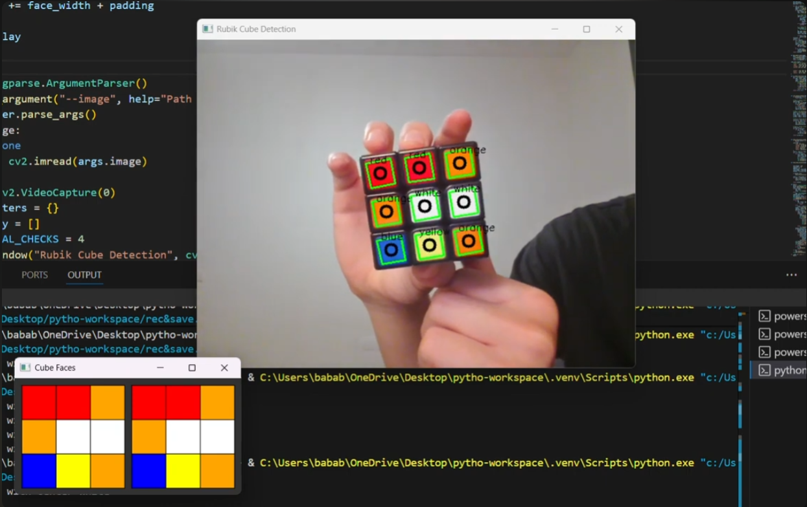

# Rubik's Cube OpenCV Solver 🧩🤖

Um projeto em Python que utiliza **Visão Computacional (OpenCV)** para detectar em tempo real o estado de um Cubo Mágico (Rubik's Cube) 3x3x3 através de uma webcam, e calcula os passos necessários para solucioná-lo.

O sistema é capaz de identificar as 6 faces do cubo automaticamente e gera a sequência de movimentos utilizando o algoritmo *Layer-by-Layer* (Camada por Camada).

 *(Coloque uma imagem do sistema em funcionamento aqui)*

## 🚀 Funcionalidades

*   **Detecção Automática:** Identifica os quadrados do cubo mesmo em cubos *stickerless* (sem bordas pretas), analisando vincos e contrastes de cor diretamente na imagem colorida.
*   **Mapeamento de Cores HSV:** Converte os pixels lidos pela câmera para a notação lógica de cores (Vermelho, Laranja, Amarelo, Verde, Azul, Branco) e permite ajustes finos.
*   **Interface 2D em Tempo Real:** Uma janela secundária desenha o "mapa" plano (planificado) do cubo conforme as faces vão sendo escaneadas.
*   **Solução Integrada:** Assim que o estado das 6 faces é capturado de forma estável, o algoritmo gera a notação padrão (U, D, R, L, F, B) necessária para montar o cubo.

## 📂 Arquitetura do Projeto

O código foi construído de forma modular para fácil manutenção e expansão:

*   `main.py`: O ponto de entrada. Orquestra a captura da câmera, gerencia o estado (loop de escaneamento) e chama o solver.
*   `vision.py`: O "cérebro" visual. Processa os frames, aplica os filtros (Blur e Canny), encontra os contornos (quadrados) e detecta a cor com base em limites HSV pré-definidos.
*   `cube_state.py`: Mantém o registro lógico do cubo na memória. Sabe interpretar qual face está sendo escaneada verificando a cor central (ex: Centro Branco = Face Up/Topo).
*   `ui.py`: Cuida da janela "Cube Faces", renderizando as peças detectadas em um layout de malha planificada.
*   `solver_utils.py`: O wrapper que se comunica com o pacote externo `rubik-cube` para calcular a solução.

## 🛠️ Como Instalar e Rodar

### Pré-requisitos
*   Python 3.7+ instalado no sistema.
*   Webcam.

### Instalação

1. Clone o repositório:
   ```bash
   git clone https://github.com/seu-usuario/cube-py.git
   cd cube-py
   ```

2. Crie e ative um ambiente virtual:
   * **Windows:**
     ```bash
     python -m venv .venv
     .\.venv\Scripts\activate
     ```
   * **Linux/Mac:**
     ```bash
     python3 -m venv .venv
     source .venv/bin/activate
     ```

3. Instale as dependências:
   ```bash
   pip install -r requirements.txt
   ```

### Executando

Para utilizar com a **webcam** (modo principal):
```bash
python main.py
```
**Dica de uso:** Aponte o cubo para a câmera. Mantenha a face estável por cerca de 1 segundo para que o sistema registre a leitura com segurança. Gire o cubo e mostre as próximas faces. Quando todas as 6 forem detectadas, a solução aparecerá na tela de vídeo.

Para processar uma **imagem estática**:
```bash
python main.py --image caminho_para_sua_foto.png
```

### Diagnóstico visual

Use `--debug` para investigar por que um frame foi aceito ou rejeitado:

```bash
python main.py --debug
python main.py --image caminho_para_sua_foto.png --debug
```

Além da janela principal, o modo abre janelas com os quadriláteros candidatos
e a face retificada. A janela principal mostra a quantidade de candidatos, a
pontuação da grade 3×3 e, quando aplicável, o motivo da rejeição.

### Validação e correção global

Depois de capturar as seis faces, o programa equilibra automaticamente as
cores para haver nove adesivos de cada uma, mantendo os seis centros fixos.
Ele só aceita uma correção se a melhor alternativa for única e descrever um
cubo fisicamente possível. Quando isso não ocorrer, as leituras são preservadas
e as faces mais suspeitas são indicadas para recaptura pelas teclas da legenda.

Se houver ajuste automático, a janela principal informa sua quantidade e o
terminal lista as posições alteradas. Com `--debug`, esse resultado também fica
disponível para diagnóstico.

Consulte o [guia de uso](GUIA_DE_USO.md) para instalar, calibrar, capturar,
recapturar, depurar e coletar imagens de avaliação.

## ⚙️ Calibração de Cores

A iluminação do ambiente (lâmpadas brancas, amarelas, luz natural) afeta drasticamente a leitura das cores pela câmera. Se o sistema estiver confundindo Laranja com Vermelho, ou Branco com Amarelo, você precisará calibrar os centros LAB.

No menu inicial, escolha a opção 1 e mostre uma face resolvida de cada cor. O
programa coleta pelo menos 30 observações durante um segundo e grava a mediana
em `calibration.json`. O arquivo também registra a variabilidade LAB e os
percentis de distância observados, junto de data e câmera. Arquivos antigos,
com apenas os centros LAB, continuam funcionando; o terminal recomenda uma
recalibração para gerar o perfil completo.

---
Desenvolvido com Python, OpenCV e a biblioteca [rubik-cube](https://pypi.org/project/rubik-cube/).
